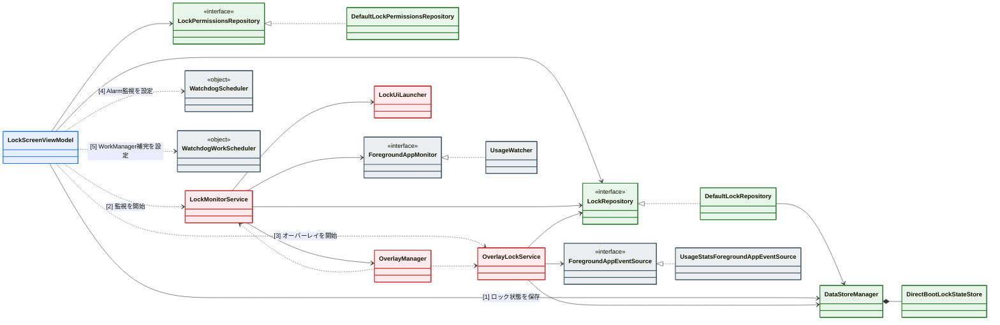

# クラス図
最終更新日: 2026-02-14

更新理由:

## この図で示すこと

- ロック機能の全体像（UI起点、状態保存、監視サービス、再実行）をわかりやすく示す。
- Interfaceと実装がどうつながっているか（DIで差し替え可能な境界）を示す。
- ロック開始時に、どのクラスがどの順で連動するかを示す

## クラス図

配色ルール:
- 青: 入口の層。ユーザー操作を受けて、ロック開始の流れを起動する。
- 緑: 判定と保存の層。権限チェックやロック状態の保存先をまとめる。
- 赤: 実行中の処理を担当する層。監視やオーバーレイ表示を動かす。
- 灰: 裏方の層。監視のインターフェース境界と、再実行を補完するウォッチドッグを表す。

矢印ルール:
- `-->` は「使う」依存を表す。クラス内部の通常処理で、別クラスを道具として参照・利用する関係。
- `..>` は「動かす」依存を表す。`start` / `stop` / `schedule` のように、外部コンポーネントを起動・制御する関係。

主要経路ラベル:
- `[1]` ロック状態を保存する。
- `[2]` 前面アプリ監視サービスを起動する。
- `[3]` オーバーレイ表示サービスを起動する。
- `[4]` Alarm ベースの監視再実行を設定する。
- `[5]` WorkManager ベースの監視再実行を設定する。

## 図で意図的に省略した内容

- ブート復元まわりの細かい分岐（BootCompletedReceiver/ BootFastStartupReceiver / WatchdogReceiver）
    - この図の目的は「ロック開始時の主要クラス連携」を伝えることであり、復元フローまで入れると焦点がぼやけるため。
- 例外処理、デバウンス、補助ストア（AllowedAppLaunchStoreなど）の詳細。
    - これらは挙動の安定化に関する補助要素であり、主要な責務分担を理解する初見読者には情報量が多すぎるため。
- UIコンポーザブルやオーバーレイ内部ビューの描画詳細
    - この図はクラス間の役割と依存関係を示すための図であり、画面描画の詳細は別の図や実装コードで追う方が分かりやすいため。
